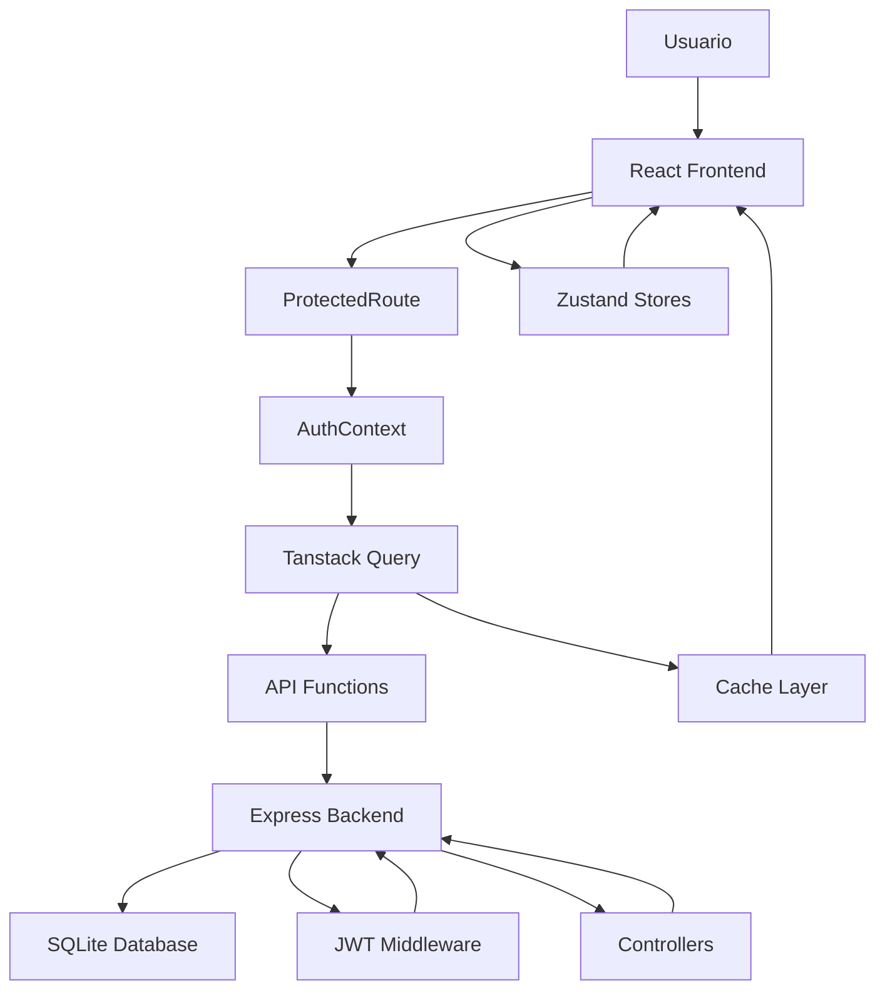

# To-Do App - Plataforma de Gestión de Tareas Colaborativa

## Descripción

**To-Do App** es una aplicación web full-stack moderna que permite a los usuarios gestionar tareas de manera colaborativa. Los usuarios pueden crear múltiples tableros organizados por categorías, compartir tableros con otros usuarios con diferentes niveles de permisos, y mantener sus tareas sincronizadas en tiempo real.

### Características Destacadas
- Sistema de autenticación JWT con cookies seguras
- Gestión de múltiples tableros por usuario
- Colaboración en tiempo real con roles de usuario
- Enlaces públicos para compartir tableros sin registro
- Panel administrativo con estadísticas del sistema
- Interfaz responsive optimizada para todos los dispositivos

## Stack Tecnológico

### Frontend
- **React 18** - Biblioteca de UI
- **Vite** - Build tool y dev server
- **TypeScript** - Type safety
- **Tailwind CSS** - Framework de estilos
- **React Router DOM** - Navegación
- **Tanstack Query** - Gestión de estado del servidor
- **Zustand** - Estado global del cliente
- **React Hook Form** - Manejo de formularios
- **React Hot Toast** - Notificaciones

### Backend
- **Node.js** - Runtime de JavaScript
- **Express.js** - Framework web
- **SQLite** - Base de datos ligera
- **JWT** - Autenticación con tokens
- **bcrypt** - Hashing de contraseñas
- **CORS** - Configuración de seguridad
- **Cookie-parser** - Manejo de cookies

## Arquitectura del Proyecto

```
To-Do-Vite/
├── src/                          # Código fuente del frontend
│   ├── components/               # Componentes reutilizables
│   │   ├── TodoForm.jsx            # Formulario de tareas
│   │   ├── TodoItem.jsx            # Item individual de tarea
│   │   ├── TodoList.jsx            # Lista de tareas
│   │   ├── TodoFilters.jsx         # Filtros y búsqueda
│   │   ├── Pagination.jsx          # Componente de paginación
│   │   ├── ToastContainer.jsx      # Sistema de notificaciones
│   │   └── ProtectedRoute.jsx      # Protección de rutas
│   ├── pages/                   # Páginas principales
│   │   ├── Home.jsx                # Página de inicio
│   │   ├── Boards.jsx              # Gestión de tableros
│   │   ├── BoardDetail.jsx         # Detalle de tablero
│   │   ├── Auth.jsx                # Autenticación
│   │   ├── AdminDashboard.jsx      # Panel administrativo
│   │   └── SharedBoard.jsx         # Tablero compartido
│   ├── hooks/                   # Hooks personalizados
│   │   ├── useTaskManager.js       # Lógica principal de tareas
│   │   ├── useTasks.js             # Hooks de Tanstack Query
│   │   └── useBoardsQuery.js       # Hooks para tableros
│   ├── stores/                  # Estado global (Zustand)
│   │   ├── taskStore.js            # Estado de tareas
│   │   ├── appStore.js             # Estado global
│   │   └── uiStore.js              # Estado de UI
│   ├── context/                 # Contextos de React
│   │   ├── AuthContext.jsx         # Contexto de autenticación
│   │   ├── ToastContext.jsx        # Contexto de notificaciones
│   │   └── SettingsContext.jsx     # Contexto de configuraciones
│   └── config/                  # Configuración
│       └── api.js                  # Funciones de API
├── backend/                     # Servidor Node.js
│   ├── routes/                  # Rutas de la API
│   │   ├── auth.js                 # Autenticación
│   │   ├── boardRoutes.js          # Gestión de tableros
│   │   ├── taskRoutes.js           # Gestión de tareas
│   │   └── admin.js                # Panel administrativo
│   ├── controllers/             # Lógica de controladores
│   ├── middleware/              # Middleware personalizado
│   ├── config/                  # Configuración
│   │   └── db.js                   # Configuración de base de datos
│   ├── services/                # Servicios de negocio
│   ├── server.js                   # Servidor principal
│   ├── seed-data.js                # Datos de prueba
│   └── database.sqlite             # Base de datos SQLite
└── public/                      # Archivos estáticos
```

## Flujo de Datos



### Flujo Detallado
1. **Usuario** interactúa con la interfaz React
2. **ProtectedRoute** verifica autenticación
3. **AuthContext** proporciona estado de usuario
4. **Tanstack Query** gestiona peticiones HTTP y caché
5. **API Functions** encapsulan llamadas al backend
6. **Express Backend** procesa peticiones con middleware JWT
7. **SQLite** almacena datos persistentes
8. **Zustand** mantiene estado local (filtros, UI)
9. **Cache** optimiza rendimiento con datos en memoria

## API Endpoints

### Autenticación (`/auth`)
| Método | Endpoint | Descripción | Body | Respuesta |
|--------|----------|-------------|------|-----------|
| `POST` | `/auth/register` | Registrar usuario | `{username, password}` | `{message}` |
| `POST` | `/auth/login` | Iniciar sesión | `{username, password}` | `{user, message}` |
| `POST` | `/auth/logout` | Cerrar sesión | - | `{message}` |

### Tableros (`/boards`)
| Método | Endpoint | Descripción | Body | Respuesta |
|--------|----------|-------------|------|-----------|
| `GET` | `/boards` | Obtener tableros del usuario | - | `[{id, name, category, created_at}]` |
| `POST` | `/boards` | Crear tablero | `{name, category}` | `{id, name, category}` |
| `DELETE` | `/boards/:name` | Eliminar tablero | - | `{message}` |
| `POST` | `/boards/:name/share` | Compartir tablero | `{username, role}` | `{message}` |
| `GET` | `/boards/:name/users` | Obtener usuarios del tablero | - | `[{username, role}]` |
| `DELETE` | `/boards/:name/users/:username` | Remover usuario | - | `{message}` |

### Tareas (`/boards/:boardName/tasks`)
| Método | Endpoint | Descripción | Query Params | Body | Respuesta |
|--------|----------|-------------|--------------|------|-----------|
| `GET` | `/tasks` | Obtener tareas | `page, limit, search, filter` | - | `{tasks, pagination}` |
| `POST` | `/tasks` | Crear tarea | - | `{text}` | `{id, text, completed}` |
| `PATCH` | `/tasks/:id` | Actualizar tarea | - | `{text, completed}` | `{id, text, completed}` |
| `DELETE` | `/tasks/:id` | Eliminar tarea | - | - | `{message}` |
| `DELETE` | `/tasks/completed` | Eliminar completadas | - | - | `{message}` |

### Administración (`/admin`)
| Método | Endpoint | Descripción | Respuesta |
|--------|----------|-------------|-----------|
| `GET` | `/admin/stats` | Estadísticas del sistema | `{users, boards, tasks}` |
| `GET` | `/admin/users` | Lista de usuarios | `[{id, username, created_at, boards_count, tasks_count}]` |
| `DELETE` | `/admin/users/:id` | Eliminar usuario | `{message}` |

### Enlaces Compartidos (`/shared`)
| Método | Endpoint | Descripción | Respuesta |
|--------|----------|-------------|-----------|
| `GET` | `/shared/:token` | Obtener tablero compartido | `{id, name, category}` |
| `GET` | `/shared/:token/tasks` | Obtener tareas del tablero | `[{id, text, completed, created_at}]` |

## Ejemplos de Uso

### Registrar un nuevo usuario
```bash
curl -X POST http://localhost:3000/auth/register \
  -H "Content-Type: application/json" \
  -d '{"username": "nuevo_usuario", "password": "mi_contraseña"}'
```

### Iniciar sesión
```bash
curl -X POST http://localhost:3000/auth/login \
  -H "Content-Type: application/json" \
  -d '{"username": "luca", "password": "admin123"}' \
  -c cookies.txt
```

### Crear un tablero
```bash
curl -X POST http://localhost:3000/boards \
  -H "Content-Type: application/json" \
  -b cookies.txt \
  -d '{"name": "Mi Proyecto", "category": "Personal"}'
```

### Obtener tareas con filtros
```bash
curl -X GET "http://localhost:3000/boards/Mi%20Proyecto/tasks?page=1&limit=10&filter=active" \
  -b cookies.txt
```

### Crear una tarea
```bash
curl -X POST http://localhost:3000/boards/Mi%20Proyecto/tasks \
  -H "Content-Type: application/json" \
  -b cookies.txt \
  -d '{"text": "Completar documentación"}'
```

## Configuración Rápida

Para configurar y ejecutar el proyecto, consulta el archivo [`SETUP.md`](./SETUP.md) que contiene las instrucciones detalladas de instalación y configuración.

### Comandos básicos
```bash
# Instalar dependencias
npm install
cd backend && npm install

# Ejecutar en desarrollo
npm run dev          # Frontend (puerto 5173)
cd backend && npm run dev  # Backend (puerto 3000)
```

## Datos de Prueba

El proyecto incluye datos de prueba predefinidos. Consulta [`DATOS_PRUEBA.md`](./backend/DATOS_PRUEBA.md) para ver las credenciales y datos disponibles.

### Usuarios de prueba
- **luca** / admin123 (Administrador)
- **maria** / password123 (Usuario)
- **juan** / password123 (Usuario)
- **ana** / password123 (Usuario)

## Características Técnicas

### Seguridad
- Autenticación JWT con cookies HTTP-only
- Hashing de contraseñas con bcrypt
- Validación de entrada en frontend y backend
- Protección CSRF con CORS configurado

### Rendimiento
- Caché inteligente con Tanstack Query
- Optimistic updates para UX inmediata
- Paginación del servidor
- Lazy loading de componentes
- Debouncing en búsquedas

### Escalabilidad
- Arquitectura modular y reutilizable
- Separación clara de responsabilidades
- Hooks personalizados para lógica de negocio
- Stores centralizados con Zustand

## Contribución

1. Fork el proyecto
2. Crear una rama para tu feature (`git checkout -b feature/AmazingFeature`)
3. Commit tus cambios (`git commit -m 'Add some AmazingFeature'`)
4. Push a la rama (`git push origin feature/AmazingFeature`)
5. Abrir un Pull Request


---

**Desarrollado con React, Node.js y SQLite**