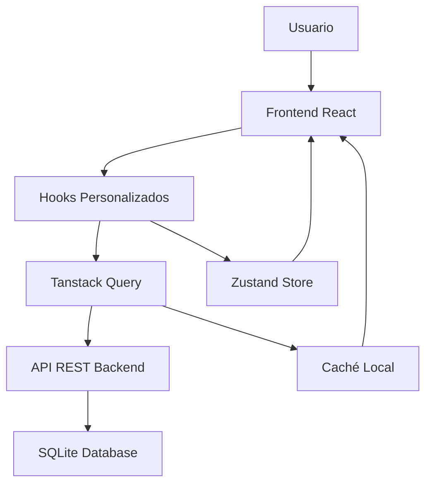

# 📝 To-Do App con Vite + React

Una aplicación **full-stack completa** de gestión de tareas construida con React, Vite, Node.js, SQLite, Tanstack Query y Zustand.

## 🚀 ¿Qué es esta aplicación?

Es una plataforma completa de gestión de tareas que permite a los usuarios organizar sus proyectos en **múltiples tableros**, **colaborar con otros usuarios**, y mantener sus tareas sincronizadas en tiempo real.

## ✨ Funcionalidades Principales

### 🔐 **Sistema de Autenticación**
- **Registro e inicio de sesión** seguro con JWT
- **Sesiones persistentes** con cookies
- **Protección de rutas** automática
- **Logout** con limpieza de sesión

### 📋 **Gestión de Tableros**
- ➕ **Crear tableros** organizados por categorías (Personal, Universidad)
- 📁 **Múltiples tableros** para diferentes proyectos
- 🗑️ **Eliminar tableros** con confirmación
- 🔍 **Búsqueda y filtrado** de tableros por categoría

### ✅ **Gestión de Tareas por Tablero**
- ➕ **Crear tareas** específicas para cada tablero
- ✏️ **Editar tareas** en línea
- ✅ **Marcar como completadas/pendientes**
- 🗑️ **Eliminar tareas** individuales o todas las completadas
- 🔍 **Búsqueda** de tareas por texto
- 🏷️ **Filtros** por estado (todas, pendientes, completadas)
- 📄 **Paginación** para manejar muchas tareas

### 👥 **Colaboración y Compartir**
- 🤝 **Compartir tableros** con otros usuarios registrados
- 👤 **Roles de usuario**: Propietario, Editor, Solo lectura
- 🔗 **Enlaces públicos** para compartir tableros (solo lectura)
- ⏰ **Enlaces con expiración** configurable
- 👥 **Gestión de usuarios** en tableros compartidos

### ⚙️ **Panel de Administración**
- 📊 **Dashboard administrativo** con estadísticas del sistema
- 👥 **Gestión de usuarios** (solo para administradores)
- 📈 **Métricas** de usuarios, tableros y tareas
- 🗑️ **Eliminación de usuarios** con confirmación

### 🎨 **Experiencia de Usuario**
- 📱 **Diseño responsive** para móvil, tablet y desktop
- 🌙 **Tema dark** moderno con Tailwind CSS
- 🔔 **Notificaciones** en tiempo real (toasts)
- ⚡ **Carga rápida** con optimizaciones de rendimiento
- 🎭 **Animaciones suaves** y transiciones

## 🛠️ Arquitectura Técnica

### **Frontend (React)**
- **React 18** - Interfaz de usuario moderna
- **Vite** - Desarrollo ultra-rápido y build optimizado
- **TypeScript** - Type safety
- **Tailwind CSS** - Estilos utility-first
- **React Router** - Navegación con protección de rutas
- **Tanstack Query** - Gestión de estado del servidor
- **Zustand** - Estado global del cliente
- **React Hook Form** - Form handling
- **React Hot Toast** - Notifications

### **Backend (Node.js)**
- **Express.js** - Servidor web RESTful
- **SQLite** - Base de datos ligera y portable
- **SQLite3** driver para Node.js
- **JWT** - Autenticación segura con tokens
- **bcrypt** - Hashing de contraseñas
- **CORS** - Configuración de seguridad
- **Cookie-parser** para manejo de cookies

### **Características Técnicas Avanzadas**
- **Autenticación JWT** con cookies HTTP-only
- **Optimistic updates** para respuesta inmediata
- **Caché inteligente** con invalidación automática
- **Paginación del servidor** para rendimiento
- **Validación** tanto en frontend como backend
- **Manejo de errores** robusto y user-friendly
- **Queries paralelas** para mejor rendimiento

## 📁 Estructura del Proyecto

```
To-Do-Vite/
├── frontend/
│   ├── src/
│   │   ├── components/     # Componentes reutilizables
│   │   ├── pages/          # Páginas principales
│   │   ├── hooks/          # Lógica de negocio personalizada
│   │   ├── stores/         # Estado global con Zustand
│   │   ├── context/        # Contextos de React
│   │   └── config/         # Configuración de API
│   └── public/
└── backend/
    ├── controllers/        # Lógica de controladores
    ├── routes/            # Rutas de la API
    ├── middleware/        # Middleware personalizado
    ├── config/           # Configuración de DB
    └── services/         # Servicios de negocio
```

## 🚀 Instalación y Configuración

### **Requisitos Previos**
- Node.js 16+ 
- SQLite (incluido con Node.js)
- npm o yarn

### **1. Configurar Backend**
```bash
cd backend
npm install

# Configurar base de datos SQLite
# La base de datos se creará automáticamente al iniciar el servidor.

npm run dev  # Servidor en http://localhost:3000
```

### **2. Configurar Frontend**
```bash
cd ../
npm install
npm run dev  # Aplicación en http://localhost:5173
```

## 📖 Guía de Uso

### **Para Usuarios Nuevos:**
1. **Regístrate** en `/auth` con un usuario único
2. **Crea tu primer tablero** desde la página de tableros
3. **Añade tareas** específicas a cada tablero
4. **Organiza** usando filtros y búsqueda
5. **Comparte** tableros con colaboradores

### **Para Colaboración:**
1. **Compartir tablero**: Añade usuarios por nombre de usuario
2. **Roles disponibles**:
   - **Propietario**: Control total
   - **Editor**: Puede modificar tareas
   - **Solo lectura**: Solo puede ver
3. **Enlaces públicos**: Genera enlaces para compartir sin registro

### **Para Administradores:**
- Acceso al dashboard en `/admin`
- Ver estadísticas del sistema
- Gestionar usuarios registrados

## 🎯 Flujo de Datos



1. **Usuario** interactúa con la interfaz React
2. **Hooks personalizados** procesan la lógica de negocio
3. **Tanstack Query** gestiona peticiones HTTP y caché
4. **API REST** procesa las peticiones en el backend
5. **SQLite** almacena los datos persistentes
6. **Zustand** mantiene estado local (filtros, UI)
7. **Caché local** optimiza la experiencia del usuario

## ⚡ Optimizaciones de Rendimiento

- **Lazy loading** de componentes grandes
- **Memoización** de cálculos costosos
- **Debouncing** en búsquedas
- **Paginación** para grandes volúmenes de datos
- **Optimistic updates** para feedback inmediato
- **Cache invalidation** inteligente
- **Consultas paralelas** cuando es posible

Esta arquitectura garantiza que la aplicación sea rápida, confiable y fácil de mantener.