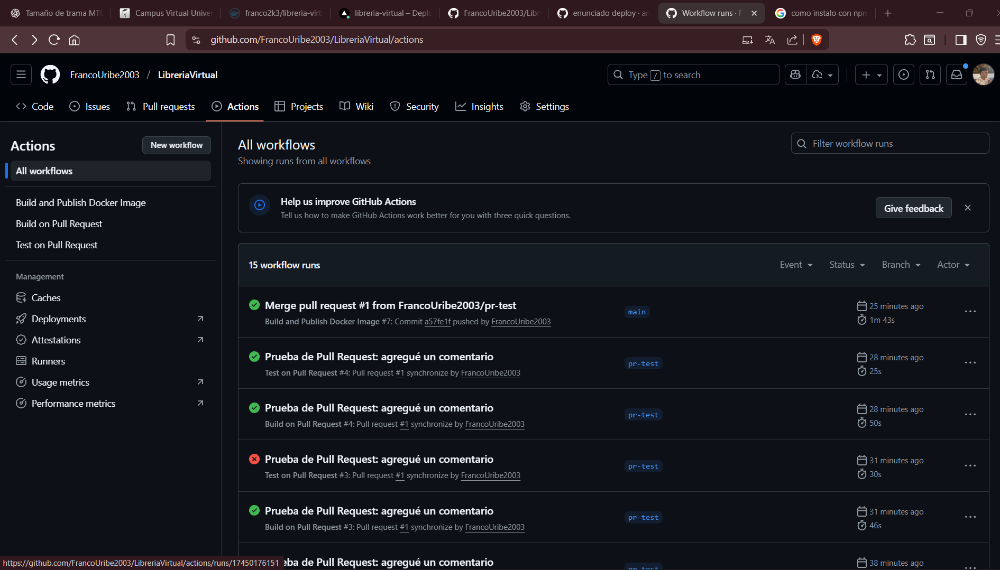

# Librería Argentina Virtual
# Comentar que este repositorio no esta actualizado con la ultima version de la aplicacion, la ultima version esta en el repositorio de GitHub

## 1. URL de la aplicación deployada

La aplicación está disponible en producción en:  
[https://libreria-virtual-hz3hjgb38-franco-ezequiel-uribes-projects.vercel.app/]

---

## 2. Repositorio GitHub

El código fuente y los workflows de GitHub Actions están en:  
[https://github.com/FrancoUribe2003/LibreriaVirtual]

---

## 3. Respositorio de DockerHub

Las imagenes son subidas en DockerHub:
[https://hub.docker.com/repository/docker/franco2k3/libreria-virtual/general]

---

## 4. Documentación

### Deploy local

1. Clona el repositorio:
   ```bash
   git clone https://github.com/FrancoUribe2003/LibreriaVirtual.git
   cd LibreriaVirtual/libreria
   Instala dependencias:

    npm install
    npm install --save-dev vitest

    Levanta la aplicación en modo desarrollo:

    npm run dev

    abrí en el navegador:

    http://localhost:3000

### GitHub Actions

- **Build on Pull Request**: se ejecuta en cada PR, instala dependencias y construye la aplicación. El PR falla si el build no es exitoso.
- **Run Tests on Pull Request**: ejecuta los tests unitarios con Vitest/Jest en cada PR.
- **Build and Publish Docker Image**: se ejecuta al pushear a `main` y construye la imagen Docker, publicándola 

