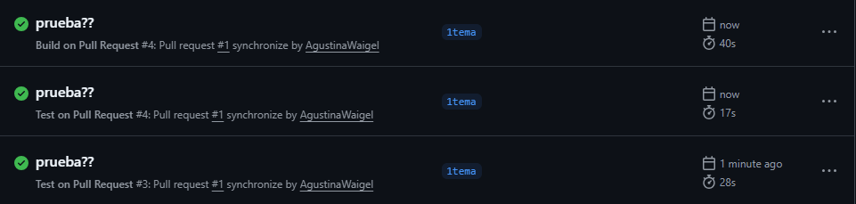

# Libro Reseñas

Plataforma de descubrimiento y reseñas de libros.

## URL de la aplicación deployada

[https://libro-resenas.vercel.app/](https://libro-resenas.vercel.app/)

## Deploy local

```bash
npm install
npm run dev
```

## Deploy con Docker

```bash
docker build -t libro-resenas .
docker run -p 3000:3000 libro-resenas
```

## GitHub Actions
- Build y tests automáticos en cada Pull Request
- Build y push de imagen Docker a ghcr.io al mergear en main/master

## Variables de entorno
Crea un archivo `.env` si tu app lo requiere. Ejemplo:
```
# .env.example
API_KEY=tu_api_key
```

## Más info
- [Vercel Documentation](https://vercel.com/docs)
- [GitHub Actions Documentation](https://docs.github.com/en/actions)
- [Docker Best Practices](https://docs.docker.com/develop/dev-best-practices/)
- [Next.js Deployment Guide](https://nextjs.org/docs/deployment)

## Demostración de Workflows


